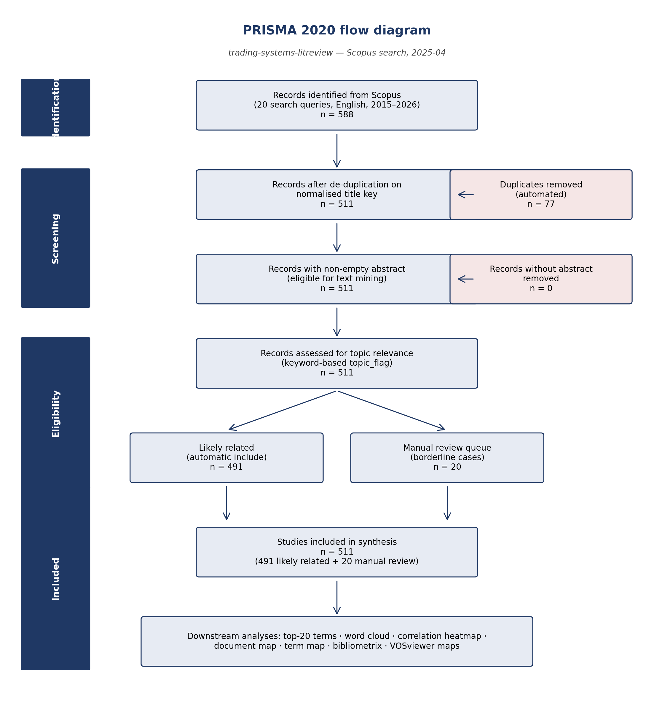

# Methodology

This document expands on the high-level pipeline summary in the main README. It describes each stage of the analysis, the design choices behind it, and where the corresponding outputs land in the repository.

The full search strategy (queries, dates, filters, inclusion/exclusion criteria) is documented separately in [`search_protocol.md`](search_protocol.md). The cleaned datasets and their column meanings are in [`data_dictionary.md`](data_dictionary.md).

## 1. Data collection

We searched Scopus on the topic of trading-system research, decision support, and trading-platform usability using 20 paired query strings. Each query was exported as a separate Scopus CSV so we can trace any paper back to the search that found it. The 20 CSV files are bundled in `data/raw/search_results_renamed.zip`. Search 13 produced no results in one of its variants and is preserved as `13_cognitive_workload_in_trading_interfaces_no_results.txt` for completeness.

The optional file `data/raw/ALL SEARCH RESULTS - v01g (1).xlsx` is a manually-compiled workbook used only as a sanity check against our rebuilt corpus; it is not part of the analytical pipeline.

## 1a. PRISMA 2020 flow

The corpus construction follows the PRISMA 2020 reporting standard (Page et al., 2021). The flow diagram below summarises the four phases — Identification, Screening, Eligibility, Included — with the counts taken from `results/logs/run_info.csv` for the reference run:



Reference-run counts:

| Phase | Stage | n |
|-------|-------|--:|
| Identification | Records identified from Scopus (20 queries) | 588 |
| Screening | Duplicates removed | 77 |
| Screening | Records after de-duplication | 511 |
| Screening | Records without abstract removed | 0 |
| Screening | Records eligible for text mining | 511 |
| Eligibility | Likely related (automatic include) | 491 |
| Eligibility | Manual review queue | 20 |
| Included | Studies included in synthesis | 511 |

The diagram is regenerated by `src/build_prisma_flow.py`, which reads the live counts from `results/logs/run_info.csv` and writes both `results/figures/prisma_flow.png` and `prisma_flow.svg`. Re-run after every pipeline run if the counts have shifted:

```bash
python3 src/build_prisma_flow.py
```

## 2. Cleaning and de-duplication (Data A)

The pipeline:

1. Reads every CSV inside the zip as character data (avoiding type-coercion surprises) and tags each row with `search_no` and `search_file`.
2. Harmonises Scopus's column-name aliases (e.g. `Source title` vs `Source Title`).
3. Drops rows without a title.
4. Computes a normalised title key (lower-case, ASCII-only, whitespace-squished) and de-duplicates on it.
5. Assigns a stable `paper_id` (`P001`, `P002`, …).

The result is `data/processed/data_a_cleaned.xlsx` — the master table with 30+ columns, full provenance, and one row per unique paper.

## 3. Abstract slice (Data B)

`data/processed/data_b_abstracts.xlsx` is the slim two-column table (`paper_id`, `abstract`) that drives the text-mining steps. It is filtered to papers with non-empty abstracts so downstream tokenisation never sees blanks.

## 4. Manual-review candidates

Papers whose keyword-relevance flag fell into the "uncertain" bucket — typically because the title/abstract did not contain any of the strict-match keywords we configured — are saved separately to `data/processed/manual_review_candidates.xlsx`. These are surfaced in the Shiny app for a human to triage.

## 5. Tokenisation and ranking

Abstracts are tokenised with `tidytext::unnest_tokens()`. We then strip:

- Standard English stop-words (from `tidytext::stop_words`).
- Domain-specific publisher noise (`elsevier`, `ltd`, `rights reserved`, `copyright`, …).
- Tokens that contain no letters (pure numerals).

The remaining vocabulary is counted and ranked. The top-20 terms become the basis for the four required visualisations:

| Output | File |
|--------|------|
| Top-20 terms (table) | `results/tables/top20_terms.{csv,xlsx}` |
| Top-20 terms (bar chart) | `results/figures/top20_terms_barplot.png` |
| Top-20 word cloud | `results/figures/wordcloud_top20_terms.png` |

## 6. Correlation heatmap

Per-document term frequencies are pivoted to a sparse paper × term matrix. We compute pairwise phi-correlations between the top-20 terms with `widyr::pairwise_cor()`. The full long-form correlation table is saved to `results/tables/top20_term_correlations_long.csv`, and rendered as a symmetric heatmap in `results/figures/top20_term_correlation_heatmap.png`.

## 7. Document map

Per-document TF-IDF weights are computed with `tidytext::bind_tf_idf()` and restricted to "informative" terms (frequency ≥ a configurable threshold; default 5). The resulting paper × term matrix is converted to a Euclidean distance matrix and projected to 2D via classical MDS (`stats::cmdscale`). Coordinates are saved to `results/tables/document_map_coordinates.csv` and rendered as `results/figures/document_map_2d.png`. Papers in the manual-review bucket are highlighted in red so reviewers can spot them quickly.

## 8. Term map

The top-20 phi-correlation matrix is converted to a `1 − correlation` distance matrix and projected to 2D via classical MDS. Coordinates are saved to `results/tables/term_map_coordinates.csv` and rendered as `results/figures/term_map_2d.png`. Tightly-correlated terms cluster together; weakly-correlated terms are pushed apart.

## 9. Descriptive summaries

`results/tables/descriptive_summaries.xlsx` contains two sheets:

- `year_summary` — documents per publication year.
- `top_sources` — the top-20 publishing venues by document count.

## 10. bibliometrix analysis

The standalone `src/bibliometrix_app.R` runs the full `bibliometrix` workflow on the same Scopus exports:

- `convert2df()` ingest, with author-country derivation patched in where Scopus did not provide it.
- `biblioAnalysis()` summary statistics.
- Bradford's law and Lotka's law fits.
- Most productive authors, sources, countries, and affiliations.
- Annual scientific production and author production over time.
- Most-cited papers (global and local).
- Keyword growth, thematic map, trend topics, conceptual structure.
- NetMatrix objects for keyword co-occurrence, co-citation, author collaboration, and country collaboration.
- Historiograph of the most-cited papers.

All outputs land under `results/bibliometrix/{figures,tables,network}/`. The cleaned `M` data frame is persisted as `results/bibliometrix/m_clean.rds` so that `biblioshiny()` can reload exactly the same dataset.

## 11. VOSviewer maps

Five complementary VOSviewer analyses live under `vosviewer_analysis/`:

| Subfolder | Map type |
|-----------|----------|
| `01_abstract_term_cooccurrence/` | Text-mined terms from abstracts. |
| `02_author_keyword_cooccurrence/` | Author-supplied keywords. |
| `03_index_keyword_cooccurrence/` | Scopus index keywords. |
| `04_country_collaboration/` | Country-level co-authorship. |
| `05_source_keyword_similarity/` | Source × keyword similarity. |

Each subfolder contains the VOSviewer `map`/`network`/`json` files, the original input network/map files used to build it, and a PNG screenshot of the saved view. See [`../vosviewer_analysis/HOW_TO_USE.md`](../vosviewer_analysis/HOW_TO_USE.md) for the load and rebuild procedures.

## 12. Run metadata and logging

Every run writes:

- `results/logs/run_log.txt` — free-text log with row counts, branch points, and warnings.
- `results/logs/run_info.csv` — a flat metric snapshot (raw rows, deduped rows, abstracts available, top-N size, bibliometrix availability).

These are what the "Reference run snapshot" table in the README is sourced from.

## Reproducibility notes

- Random seeds are set before any stochastic step (currently the wordcloud only).
- All file paths are computed relative to the project root, so the pipeline is portable across machines.
- The unzipped CSVs and every entry under `data/interim/`, `data/processed/`, and `results/` are gitignored — they are regenerated from `data/raw/search_results_renamed.zip` on every run.
